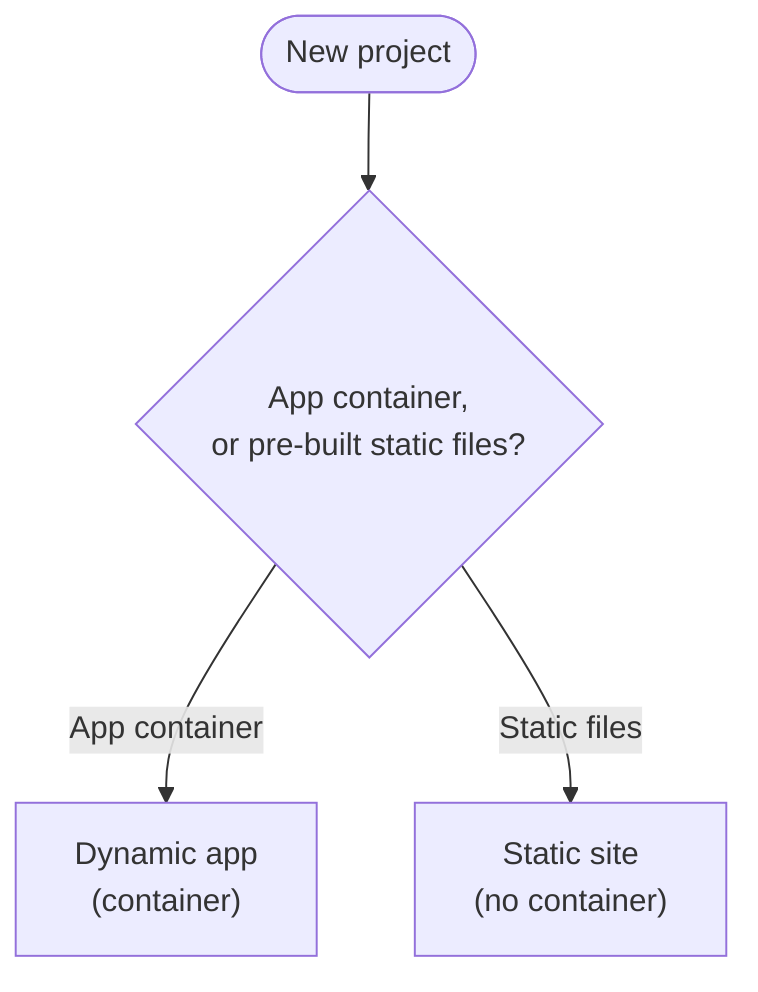

# 🪄 Baton Orchestrator

> **Every orchestra needs a baton — so does your VPS.**  

Deploy and manage multiple projects — **containerized apps or static sites** — with **NGINX reverse proxying**, **automatic SSL**, **project isolation**, and **git-powered webhooks** — all without Kubernetes-level complexity.

---

## 🚀 Overview

**Baton Orchestrator** is built for developers and sysadmins who want:

- Deploy and manage multiple projects on a single VPS — **Docker Compose apps or plain static sites** (no compose file required)
- A fully automated **NGINX ingress + SSL** pipeline  
- **No control-plane daemon** — all deploy/management logic is **plain POSIX shell** (the only long-running pieces are the shared NGINX + webhook worker)
- **Git-powered auto-deploy** via isolated webhook handlers  
- A predictable structure under `/opt/baton-orchestrator` & `/srv/projects`
- Run on **Alpine Linux**, but portable across most POSIX environments

---

## ✨ Features

- 🧠 **Project-based structure** (`/srv/projects/<name>`)
- ⚙️ **One-command deployment**  
- 🔐 **Automatic SSL issuance + renewal** using Certbot  
- 🌐 **NGINX reverse proxy orchestration** using project templates  
- 🎛️ **Dedicated scripts for deployment, activation, cleanup, testing**  
- 🔄 **Webhook support** for push-to-deploy workflows  
- 🧱 **Daemon-free control logic** — deploy/management is modular shell; the only resident services are the shared NGINX ingress and webhook worker  
- 🔌 **Strict isolation** between orchestrator, projects, and webhook worker  
- 🌐 **Subdomain-friendly** — run many projects as subdomains of one domain (a single wildcard DNS record covers unlimited projects)
- 🗂️ **Static site mode** — serve pre-built sites with no app container at all

---

## 🧭 Choose Your Deployment Path

Every project is served over HTTPS on a domain — or a **subdomain**, which is how you run many projects cheaply from one domain (see [Scaling with subdomains](#scaling-with-subdomains-one-domain-many-projects)). The only choice left is **how it's served**: a running app container, or a pre-built static site with nginx serving the files directly.



| Path | Serving | Use it when... |
|---|---|---|
| [**Dynamic app (container)**](#deploying-a-dynamic-app-container) | App container (Django, Rails, Node, etc.) | Anything with a backend process behind `docker-compose.yml`. |
| [**Static site**](#deploying-a-static-site) | Pre-built static files, no container | A finished static site (blog, docs, marketing page) — plain HTML/CSS/JS. |

> **No domain per project?** You don't need one. Point a single wildcard domain at the VPS and give each project its own subdomain — every project still gets its own TLS cert and webhook auto-deploy. See [Scaling with subdomains](#scaling-with-subdomains-one-domain-many-projects).

Both paths share the same two setup steps first (below), then diverge only at the project's own `.env` and `server.conf` (plus a `docker-compose.yml` for the dynamic path; static sites need none).

---

## 📦 Installation

### 1️⃣ Clone the repository

```bash
git clone https://github.com/roldel/baton-orchestrator.git /opt/baton-orchestrator
cd /opt/baton-orchestrator
```

### 2️⃣ Run setup (as root)

```bash
./scripts/setup.sh
```

This will:

- Install system dependencies  
- Create internal directories (including `/srv/projects`)  
- Start the orchestrator's NGINX + webhook worker + Docker network  
- Install the SSL auto-renewal cron job  
- Install and start the `baton-webhook` watcher service (OpenRC)  

You should see:

```
Setup complete!
   Nginx is running
   Webhook service is running
   Certbot will start on-demand during first deploy
   Run: ./scripts/cmd/deploy.sh <project-name>
```

With setup done, jump to whichever path above matches your project.

---

## 🧱 Directory Structure

```text
.
├── orchestrator/                # Core stack (nginx + webhook + certbot config)
│   ├── docker-compose.yml
│   ├── nginx/
│   │   ├── admin-conf.d/
│   │   └── nginx.conf
│   └── webhook/
│       ├── app.py
│       ├── utils.py
│       ├── Dockerfile
│       └── requirements.txt
│
├── scripts/
│   ├── cmd/
│   │   ├── deploy.sh
│   │   ├── stand-down.sh
│   │   ├── respawn.sh
│   │   ├── rebuild-all.sh
│   │   ├── status.sh
│   │   ├── remove-project.sh
│   │   ├── orchestrator-compose-respawn.sh
│   │   ├── webhook-activate.sh
│   │   └── webhook-deactivate.sh
│   ├── tools/                   # helpers, projects, nginx, ssl, webhook, static, analytics
│   ├── baton                    # global CLI wrapper, installed to /usr/local/bin/baton by setup.sh
│   └── setup.sh
│
├── example-project/              # dynamic-app reference (container)
├── example-project-static/       # static-site reference
│
└── /srv/projects/<project-name>/ # where YOUR projects actually live (not in this repo)
```

---

## Deploying a dynamic app (container)

A running app container (Django, Rails, Node, whatever's behind `docker-compose.yml`), served over HTTPS on a domain or subdomain. Reference: `example-project/`.

**Checklist:**
- [ ] Point the domain (or subdomain) at your VPS IP — see [Scaling with subdomains](#scaling-with-subdomains-one-domain-many-projects) for the one-wildcard-record setup
- [ ] Add `.env`, `server.conf`, `docker-compose.yml` to `/srv/projects/<project-name>/`
- [ ] `./scripts/cmd/deploy.sh <project-name>`

`.env`:

```ini
## PROJECT

# Mandatory
DOMAIN_NAME=example.com
DOMAIN_ADMIN_EMAIL=admin@example.com
APP_PORT=8000
DOCKER_NETWORK_SERVICE_ALIAS=myapp

# Optional
DOMAIN_ALIASES=www.example.com,api.example.com


## WEBHOOK (optional push-to-deploy — see "Webhook auto-deploy" below)

# Mandatory
WEBHOOK_URL=/webhook # If webhook set on https://example.com/mywebhookurl our WEBHOOK_URL should be /mywebhookurl
PAYLOAD_SIGNATURE=supersecret-shared-with-github

# Optional
REPO_LOCATION=/srv/projects/<project-name> # If different from standard /srv/projects/<project-name>
DOCKER_COMPOSE_RESTART_REQUIRED=NO # Auto rebuild and restart docker compose cluster upon redeploy
TARGET_BRANCH=main
COMMIT_DOCKER_COMPOSE_RESTART_TRIGGER=[restart-compose] # If DOCKER_COMPOSE_RESTART_REQUIRED=NO, allow possibility to trigger docker compose rebuild and restart on demand through commit message flag

CI_PIPELINE_LOCATION=/srv/ci/pipelines/myproject # If CI pipeline to be implemented

CUSTOM_REDEPLOY_SCRIPT_LOCATION=/srv/scripts/redeploy_myproject.sh # If non standard redeploy script to be executed
```

`server.conf`:

```sh
# HTTP (80): ACME challenge + redirect to HTTPS
server {
    listen 80;
    listen [::]:80;
    server_name ${DOMAIN_NAME} ${DOMAIN_ALIASES};

    # ← ACME CHALLENGE: Highest priority, serves Let's Encrypt
    location ^~ /.well-known/acme-challenge/ {
        root /var/www/acme-challenge;
        try_files $uri =404;
    }

    # Optional: Health check (doesn't interfere)
    location = /healthz {
        return 200 'healthy';
    }

    # Everything else → redirect to HTTPS
    location / {
        return 301 https://$host$request_uri;
    }
}

# HTTPS (443): TLS + reverse proxy to app
server {
    listen 443 ssl;
    listen [::]:443 ssl;

    http2 on;

    server_name ${DOMAIN_NAME} ${DOMAIN_ALIASES};

    ssl_certificate     /etc/letsencrypt/live/${DOMAIN_NAME}/fullchain.pem;
    ssl_certificate_key /etc/letsencrypt/live/${DOMAIN_NAME}/privkey.pem;

    # Static files
    location /static/ {
        alias /srv/shared-files/${DOMAIN_NAME}/static/;
        # expires 30d;
    }

    # Media files
    location /media/ {
        alias /srv/shared-files/${DOMAIN_NAME}/media/;
        # access_log off;
        expires 1h;
    }

    # Webhook location snippet (if present)
    include /etc/nginx/webhooks.d/${DOMAIN_NAME}-*.conf;

    # Proxy to app
    location / {
        proxy_set_header Host              $host;
        proxy_set_header X-Real-IP         $remote_addr;
        proxy_set_header X-Forwarded-For   $proxy_add_x_forwarded_for;
        proxy_set_header X-Forwarded-Proto $scheme;

        proxy_pass http://${DOCKER_NETWORK_SERVICE_ALIAS}:${APP_PORT};
    }
}
```

`docker-compose.yml`:

```yml
services:

  db: #secondary-service(db,tools,...)
    #...
    env_file:
      - .env
    # Needs to be added on a default network to communicate with primary service
    networks:
      default: {}

  django: #application server (django,ruby,laravel...)
    #...
    env_file:
      - .env
    # Expected volume mapping for project static files
    volumes:
      - /srv/shared-files/${DOMAIN_NAME}/static:/static_files:rw
      - /srv/shared-files/${DOMAIN_NAME}/media:/media:rw
    # Define networks as follow
    networks:
      # Default network to communicate with secondary services
      default: {}
      # External network to communicate with main orchestrator docker compose
      internal_proxy_pass_network:
        aliases:
          - ${DOCKER_NETWORK_SERVICE_ALIAS}

# Add network definition in footer
networks:
  default: {}
  internal_proxy_pass_network:
    external: true
```

---

## Deploying a static site

A pre-built static site (blog, docs, marketing page — plain HTML/CSS/JS, no backend process) served over HTTPS on a domain or subdomain. No `docker-compose.yml` needed. Reference: `example-project-static/`.

**Checklist:**
- [ ] Point the domain (or subdomain) at your VPS IP — see [Scaling with subdomains](#scaling-with-subdomains-one-domain-many-projects) for the one-wildcard-record setup
- [ ] Add `.env` and `server.conf` to `/srv/projects/<project-name>/` (build your site into `STATIC_SOURCE_DIR` first, or let `CI_PIPELINE_LOCATION` build it on deploy)
- [ ] `./scripts/cmd/deploy.sh <project-name>`

`.env`:

```ini
### MANDATORY

DOMAIN_NAME=example.com
DOMAIN_ADMIN_EMAIL=admin@example.com

# No app container — nginx serves a synced copy of STATIC_SOURCE_DIR directly.
STATIC_SITE=yes

# Directory (relative to this project's root) containing the already-built
# site — e.g. `build`, `dist`, `out`, `public`, `_site`, depending on your
# static site generator. Deliberately NOT hardcoded to `static/`: several
# frameworks (e.g. SvelteKit) already use a top-level `static/` for
# unprocessed source assets, not the final build output.
STATIC_SOURCE_DIR=build

### OPTIONAL
DOMAIN_ALIASES=www.example.com


### WEBHOOK (optional push-to-deploy — see "Webhook auto-deploy" below)

WEBHOOK_URL=/webhook
PAYLOAD_SIGNATURE=supersecret-shared-with-github

REPO_LOCATION=/srv/projects/<project-name>
TARGET_BRANCH=main

# If STATIC_SOURCE_DIR isn't already committed pre-built, point this at a
# build script (e.g. running `npm run build`) — it runs after git pull and
# before the static sync, so the sync always picks up freshly-built output.
CI_PIPELINE_LOCATION=/srv/ci/pipelines/myproject
```

`server.conf`:

```sh
# HTTP (80): ACME challenge + redirect to HTTPS
server {
    listen 80;
    listen [::]:80;
    server_name ${DOMAIN_NAME} ${DOMAIN_ALIASES};

    location ^~ /.well-known/acme-challenge/ {
        root /var/www/acme-challenge;
        try_files $uri =404;
    }

    location / {
        return 301 https://$host$request_uri;
    }
}

# HTTPS (443): TLS + serve the synced static build directly (no proxy_pass —
# there is no app container in static-site mode)
server {
    listen 443 ssl;
    listen [::]:443 ssl;

    http2 on;

    server_name ${DOMAIN_NAME} ${DOMAIN_ALIASES};

    ssl_certificate     /etc/letsencrypt/live/${DOMAIN_NAME}/fullchain.pem;
    ssl_certificate_key /etc/letsencrypt/live/${DOMAIN_NAME}/privkey.pem;

    # Webhook location snippet (if present)
    include /etc/nginx/webhooks.d/${DOMAIN_NAME}-*.conf;

    # scripts/tools/static/sync-static-site.sh copies STATIC_SOURCE_DIR here
    # on every deploy/redeploy — see ${SITE_KEY} (== ${DOMAIN_NAME} here).
    root /srv/shared-files/${SITE_KEY}/site;
    index index.html;

    location / {
        try_files $uri $uri/ =404;
    }
}
```

No `docker-compose.yml` — see [Static sync mechanics](#static-sync-mechanics) below for how the build output actually gets to nginx.

---

## Cross-Cutting Mechanics

These apply across whichever path they're relevant to — documented once here instead of repeated per section.

### Scaling with subdomains (one domain, many projects)

Domains are the one costly, slow part of standing up a project — so don't buy one per project. Buy **one** domain, point it at the VPS with a wildcard record, and give each project its own subdomain. Baton makes no distinction between a subdomain and a standalone domain: `blog.example.com` and `shop.example.com` are just two independent projects.

**1. One-time DNS setup (at your registrar):**

```
*.example.com   A   <VPS_IP>
```

A single wildcard `A` record makes *every* subdomain resolve to the VPS instantly — `blog`, `shop`, `demo-tuesday`, anything you invent — with no further DNS edits, ever. (You can instead point the wildcard via a CNAME to the apex — `*.example.com CNAME example.com` — where the apex `example.com A <VPS_IP>`; the apex itself must be an `A` record, it can't be a CNAME.) Wildcards match **one label only**: `*.example.com` covers `test1.example.com` but not the apex `example.com` nor a nested `www.test1.example.com`.

**2. Per project:** set the subdomain as `DOMAIN_NAME` and deploy — nothing else changes.

```ini
# /srv/projects/test1/.env
DOMAIN_NAME=test1.example.com
DOMAIN_ADMIN_EMAIL=you@example.com
APP_PORT=8000
DOCKER_NETWORK_SERVICE_ALIAS=test1-app     # ← MUST be unique per project
```

Each subdomain project gets its **own** everything: a TLS cert (issued per subdomain via HTTP-01 — the ACME challenge is served for any host, so a freshly-resolving subdomain just works), nginx conf, `/srv/shared-files/<subdomain>/` dir, and webhook routing (matched by `Host`). `deploy.sh`, `webhook-activate.sh`, `stand-down.sh`, and `respawn.sh` all operate per project, unchanged.

**The one gotcha — `DOCKER_NETWORK_SERVICE_ALIAS` must be unique per project.** All app containers share the one external `internal_proxy_pass_network`, and nginx reaches each by `proxy_pass http://<alias>:<port>`. Two projects with the *same* alias would make Docker's DNS round-robin between them — requests for one could land on the other. Give each a distinct alias (`test1-app`, `test2-app`). `APP_PORT` **can** be identical across projects (it's container-internal, reached by alias — nothing is published to the host).

**Aliases (`DOMAIN_ALIASES`)** work for subdomains too, but a nested alias like `www.test1.example.com` is two labels deep, so the single-label wildcard does *not* cover it — add an explicit record (e.g. `www.test1.example.com CNAME test1.example.com`). Every name in `DOMAIN_ALIASES` must resolve, or the whole HTTP-01 request fails. A flat single-label alias is already covered by the wildcard.

**Worth knowing:**
- **Rate limits:** Let's Encrypt caps *new* certificates per registered domain at ~50/week. Each new subdomain is a new cert; aliases are SANs on one cert (essentially free). Spinning up dozens of brand-new subdomains in one week can hit the cap — normal use and renewals don't.
- **Cert persistence:** `ensure-certs.sh` is idempotent and `stand-down.sh` never deletes certs, so redeploying / standing down / respawning a subdomain **reuses** its existing cert — no revalidation, no rate-limit pressure from churn.
- **Isolation is logical, not physical:** subdomain projects are independent *sites* (routing, TLS, lifecycle) but co-tenant on one host, one ingress, one webhook worker, and the shared `internal_proxy_pass_network` — so they are **not** network-isolated from each other. They also share the parent domain's fate (registrar, rate limit, and public Certificate-Transparency visibility of every subdomain name).

### Static sync mechanics

*(Static sites)* On every `deploy.sh` (and, if webhook is active, every auto-deploy via `handle-webhook.sh`), `scripts/tools/static/sync-static-site.sh` publishes `STATIC_SOURCE_DIR` under `/srv/shared-files/<SITE_KEY>/site` — the path your `server.conf`'s `root` points at. It uses a **release-symlink model**: each sync copies the build into a fresh, fully-formed release directory (`/srv/shared-files/<SITE_KEY>/releases/release-<timestamp>`), and only once that copy is complete does it repoint the `site` symlink at the new release. nginx therefore always follows `site` to a whole tree — never an empty or half-copied one — and the swap is a single symlink flip rather than a partially-populated directory. The newest few releases are kept and older ones pruned. It's a **wholesale replace, not rsync/diff**: each release is the full build output, so files deleted from your build disappear from the live site too — there's no merging.

`docker-compose.yml` is not required for static projects — `validate-content.sh` skips that check, and `deploy.sh`/`stand-down.sh` skip the container restart/stop steps entirely.

### Webhook auto-deploy

Both paths — dynamic and static — support **push-to-deploy**. Activate it per project with `webhook-activate.sh <project>` once the site is live; it requires `DOMAIN_NAME`, `WEBHOOK_URL`, and `PAYLOAD_SIGNATURE` in the project's `.env`. On a matching push, the webhook worker identifies the project by its `Host` header, verifies the GitHub HMAC signature (`X-Hub-Signature-256`), checks the branch against `TARGET_BRANCH`, and triggers a redeploy. For static sites, `CI_PIPELINE_LOCATION` (if set) runs before the static sync so the served build is freshly rebuilt. See the `.env` blocks above for the webhook fields.

---

## 🧰 Commands Summary

`setup.sh` installs the `baton` CLI to `/usr/local/bin/baton`, so every command below can also be run as `baton <command> [arguments]` from anywhere (e.g. `baton deploy <project> --webhook`, `baton status`). Run `baton help` for the full list.

| Command | Description |
|----------|-------------|
| `./scripts/setup.sh` | Initialize orchestrator (Alpine/Linux VPS) |
| `./scripts/cmd/deploy.sh <project> [--webhook]` | Deploy or update project; `--webhook` also activates its webhook afterward |
| `./scripts/cmd/stand-down.sh <project>` | Disable project (keeps SSL) |
| `./scripts/cmd/respawn.sh <project>` | Full reset: stand down, redeploy, restore webhook if it was active |
| `./scripts/cmd/rebuild-all.sh [--mode dynamic\|static] [--dry-run]` | Respawn all projects, optionally filtered by mode |
| `./scripts/cmd/status.sh [project]` | Overview of all projects (mode, site, containers, webhook), or a single project |
| `./scripts/cmd/remove-project.sh <project> [--delete-files]` | Remove a project from Baton management; keeps SSL cert and shared files unless `--delete-files` is passed |
| `./scripts/cmd/webhook-activate.sh <project>` | Add and connect webhook endpoint and redeploy scripts |
| `./scripts/cmd/webhook-deactivate.sh <project>` | Remove webhook endpoint, disable auto redeploy |
| `./scripts/cmd/orchestrator-compose-respawn.sh` | Recreate the orchestrator stack (nginx/webhook/certbot) after editing `orchestrator/docker-compose.yml`; brief nginx blip for ALL live projects |
| `./scripts/tools/analytics/report.sh [--since <window>] [--host <host>]` | Simple traffic report from nginx logs (default: last 24h, all hosts) |
| `./scripts/cleanup.sh` | (irreversible) Remove orchestrator and all configs |

---

## 🤝 Contributing

PRs and ideas welcome!

## 📜 License

MIT License.
